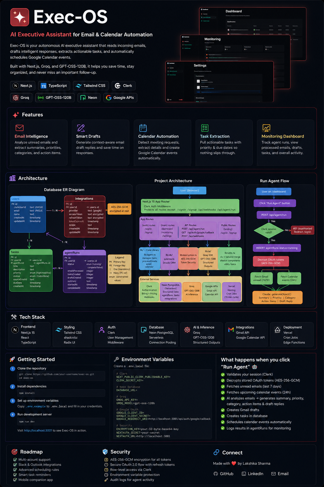
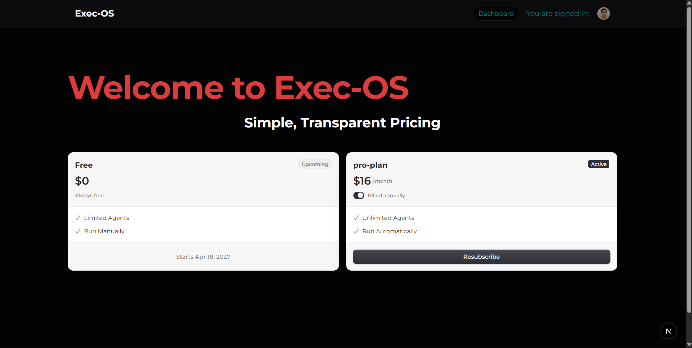
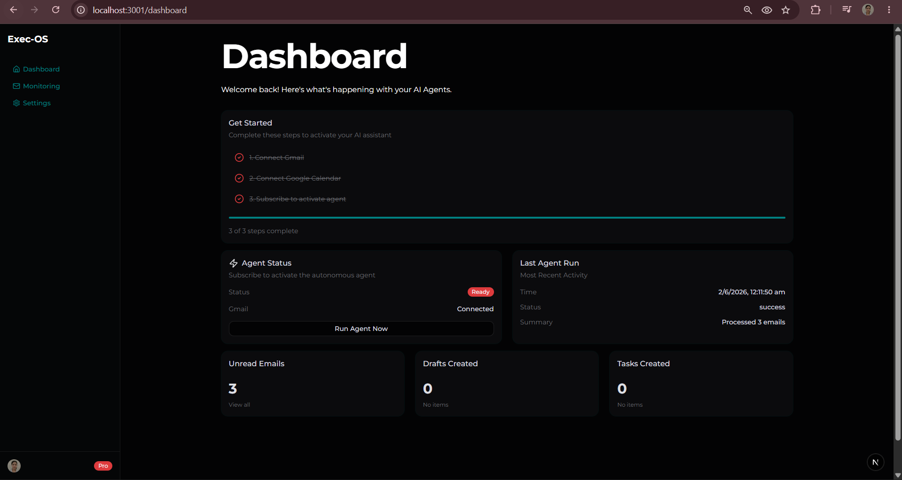
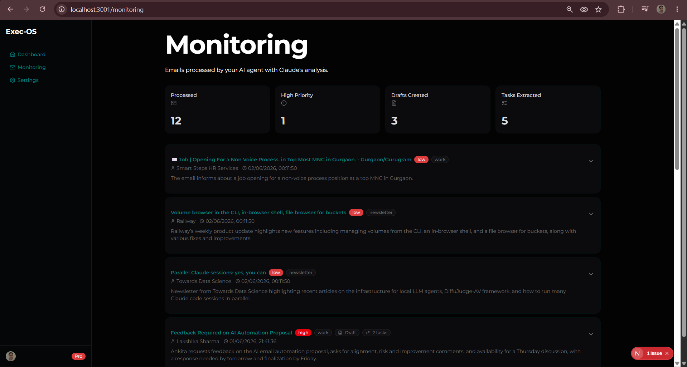
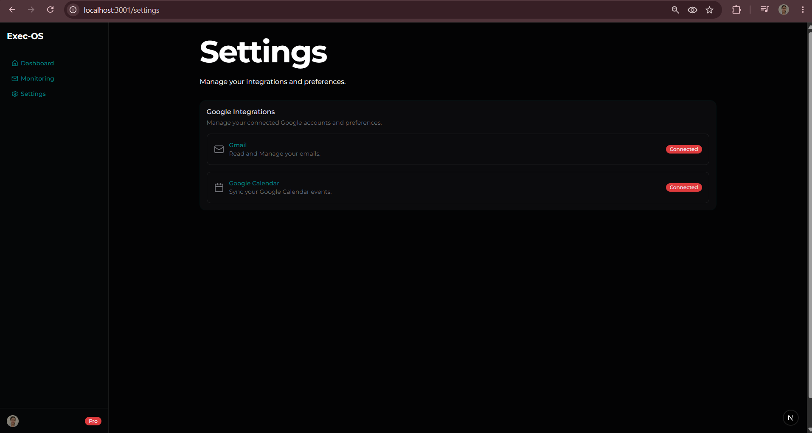
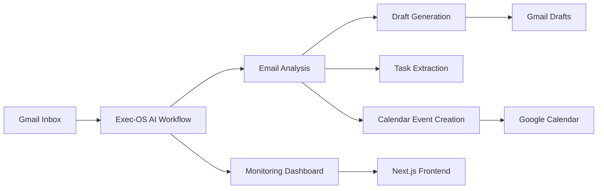

# 🚀 Exec-OS

### AI Executive Assistant for Email & Calendar Automation

Exec-OS is an AI-powered executive assistant that helps users manage communication and scheduling workflows automatically.

The system analyzes incoming emails, generates intelligent draft responses, extracts actionable tasks, and schedules Google Calendar events through AI-driven automation.




Built with **Next.js**, **TypeScript**, **Groq**, **GPT-OSS-120B**, **Google APIs**, **Clerk**, and **Neon PostgreSQL**.


---

## ✨ Features

### 📧 Email Intelligence

* Analyze incoming Gmail messages
* Generate concise summaries
* Categorize and prioritize emails
* Identify actionable tasks

### ✍️ Smart Draft Generation

* Generate contextual email drafts
* Reduce manual email writing
* Assist with professional communication workflows

### 📅 Calendar Automation

* Detect meeting requests from emails
* Extract dates, times, and participants
* Automatically create Google Calendar events

### 📋 Task Extraction

* Extract action items from emails
* Assign priorities
* Track tasks generated by the AI workflow

### 📊 Monitoring Dashboard

* Track agent executions
* Review processed emails
* View generated drafts and tasks
* Monitor overall workflow activity

### 🔐 Secure Integrations

* Google OAuth Authentication
* Gmail API Integration
* Google Calendar API Integration
* Clerk User Authentication
* Secure token storage

---


<h2>📸 Application Preview</h2>


<h3>Dashboard</h3>
Monitor agent activity, email processing statistics, drafts, and generated tasks.




<h3>Monitoring</h3>
Track processed emails, extracted tasks, generated drafts, and workflow execution history.




<h3>Settings</h3>
Manage Gmail and Google Calendar connections.




---

## 🏗️ System Architecture



---

## ⚙️ Run Agent Workflow

```text
User clicks "Run Agent"

↓
Validate Clerk Session

↓
Fetch Gmail Messages

↓
Fetch Calendar Context

↓
GPT-OSS-120B Analysis

↓
Generate Summary

↓
Generate Draft Reply

↓
Extract Action Items

↓
Create Calendar Events

↓
Store Results in Database

↓
Display Results in Monitoring Dashboard
```

---

## 🛠️ Tech Stack

| Category             | Technology          |
| -------------------- | ------------------- |
| Frontend             | Next.js             |
| Language             | TypeScript          |
| Styling              | Tailwind CSS        |
| Authentication       | Clerk               |
| Database             | Neon PostgreSQL     |
| AI Inference         | Groq                |
| Model                | GPT-OSS-120B        |
| Email Integration    | Gmail API           |
| Calendar Integration | Google Calendar API |
| Hosting              | Vercel              |

---

## 🗄️ Database Design

Core entities:

### Users

Stores authenticated user information.

### Integrations

Stores encrypted Google OAuth credentials.

### Tasks

Stores action items extracted from emails.

### Agent Runs

Stores execution logs, summaries, and processing statistics.

---

## 🚀 Getting Started

### Clone Repository

```bash
git clone https://github.com/Lakshika1485/EXEC-OS.git

cd EXEC-OS
```

### Install Dependencies

```bash
npm install
```

### Configure Environment Variables

Create a `.env.local` file:

```env
# Clerk
NEXT_PUBLIC_CLERK_PUBLISHABLE_KEY=
CLERK_SECRET_KEY=

# Database
DATABASE_URL=

# Groq
GROQ_API_KEY=

# Google OAuth
GOOGLE_CLIENT_ID=
GOOGLE_CLIENT_SECRET=
GOOGLE_REDIRECT_URI=

# Security
ENCRYPTION_KEY=
```

### Run Development Server

```bash
npm run dev
```

Open:

```text
http://localhost:3001
```

---

## 📈 Future Improvements

* Multi-account Gmail support
* Outlook Integration
* Slack Integration
* Agent memory and personalization
* Scheduled autonomous execution
* Advanced analytics dashboard
* Multi-agent workflow orchestration

---

## 🔒 Security

* OAuth-based Google authentication
* Secure credential storage
* Clerk-protected routes
* Encrypted integration tokens
* Server-side API execution

---

## 👨‍💻 Author

**Lakshika Sharma**

AI/ML Engineer | Building AI Agents, LLM Applications, and Intelligent Automation Systems

GitHub: https://github.com/Lakshika1485

---

⭐ If you found this project interesting, consider starring the repository.
